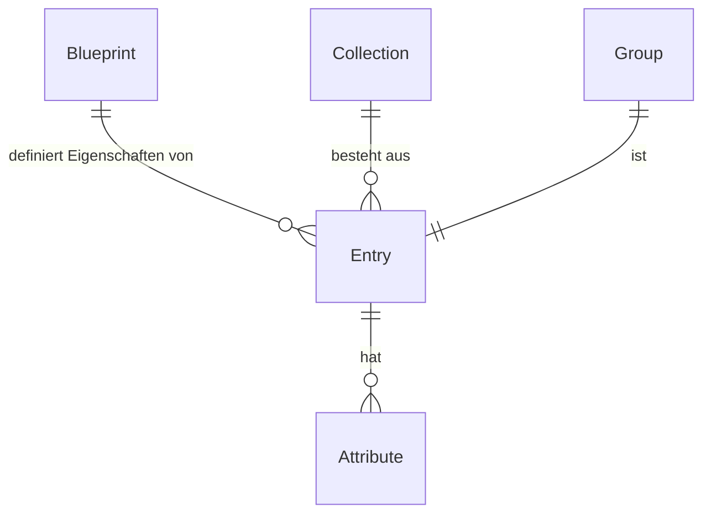

# CM42

## Glossar

| Element    | Beschreibung                                                                                                       |
| ---------- | ------------------------------------------------------------------------------------------------------------------ |
| Entry      | Ein Entry ist eine Sammlung von Attributen.                                                                        |
| Blueprint  | Ein Blueprint definiert, welche Attribute ein Entry hat. Diese Attribute können in dem Blueprint gruppiert werden. |
| Attribut   | Ein Attribut ist ein Feld (FieldEntry) eines Entries. Dies beinhaltet den Value und weitere Eigenschaften.         |
| Collection | Eine Collection ist eine Sammlung von Entries                                                                      |
| Group      | Eine Gruppe ist einzelnes Entry. Hierrüber können zum Beispiel Einstellungen realisiert werden.                    |
| FieldTypes | Datentypen für die Attribute                                                                                       |

## Blueprint (`blueprints`)

Ein Blueprint definiert alle Eigenschaften eines Entries. Dies passiert mittels `blueprint_field_types`. Diese Speichern, welche `field_types` einem Blueprint zugewiesen werden.

### Blueprintgroup (`blueprint_field_type_groups`)

`blueprint_field_types` können in `blueprint_field_type_groups` gruppiert werden. 

